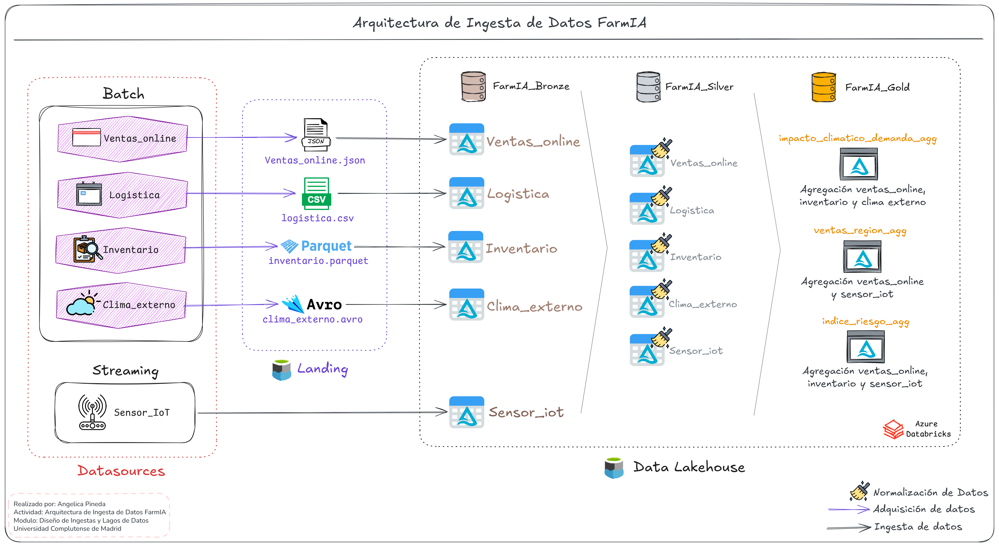

# Arquitectura de Ingesta y Lakehouse: FarmIA

Este documento describe la arquitectura de datos del ecosistema analítico de FarmIA. La solución está diseñada sobre Azure Databricks y sigue el patrón Medallion, con capas Bronze, Silver y Gold, para soportar tanto ingesta Batch como Streaming en tiempo real.

## Diagrama de referencia

El flujo general de la solución se resume en el siguiente diagrama:

## Flujo de la arquitectura

La arquitectura organiza el recorrido de los datos en varias etapas claramente separadas. Cada una cumple un propósito concreto, desde la captura inicial hasta la preparación final para analítica y consumo de negocio.

### 1. Orígenes de datos y capa Landing

La arquitectura integra fuentes heterogéneas bajo dos paradigmas de ingesta:

- Batch: los sistemas origen generan archivos estáticos con distintos formatos y estructuras. En este caso, se contemplan `Ventas_online` en JSON, `Logística` en CSV, `Inventario` en Parquet y `Clima_externo` en Avro.
- Streaming: los datos en tiempo real producidos por dispositivos y maquinaria, representados por `Sensor_IoT`, se envían directamente al motor de ingesta, normalmente a través de un broker como Apache Kafka, sin pasar por la capa de ficheros estáticos.

En el caso Batch, los archivos se depositan primero en una Landing Zone, que actúa como área temporal de staging sobre almacenamiento de objetos en la nube.

### 2. Capa Bronze: ingesta cruda

Bronze es la primera capa del lakehouse. Aquí el motor de ingesta, apoyado en tecnologías como Databricks Auto Loader y Spark Structured Streaming, lee tanto los ficheros de la Landing Zone como los eventos en tiempo real y los persiste en tablas dentro de `FarmIA_Bronze`.

En esta etapa los datos se mantienen en su estado original, sin transformaciones de negocio, y únicamente se añaden metadatos técnicos como la fecha de ingesta o la ruta de origen. Esto garantiza trazabilidad, inmutabilidad y conservación del histórico completo.

### 3. Capa Silver: limpieza y normalización

Los datos pasan de Bronze a Silver mediante procesos de estandarización, limpieza y normalización. En esta fase se aplican reglas de calidad técnica como:

- deduplicación de registros,
- casteo y homogeneización de tipos de datos,
- resolución de esquemas,
- tratamiento de valores nulos,
- filtrado de anomalías.

El resultado son tablas refinadas, estructuradas y confiables para las entidades principales: `Ventas`, `Logística`, `Inventario`, `Clima` y `Sensores`. Esta capa actúa como la base consistente de referencia para el resto del modelo.

### 4. Capa Gold: agregación y consumo de negocio

Gold es la capa de consumo analítico y está optimizada para Business Intelligence y Machine Learning. A partir de los datos ya estructurados en Silver, se realizan cruces entre dominios y agregaciones más complejas para producir entidades directamente alineadas con los requerimientos de negocio de FarmIA.

Las principales tablas modeladas en esta capa son:

- `impacto_climatico_demanda_agg`: se construye a partir del cruce entre ventas online, inventario y clima externo para analizar cómo la meteorología afecta al consumo y al stock.
- `ventas_region_agg`: combina el rendimiento transaccional de `ventas_online` con datos contextuales o de geolocalización procedentes de `sensor_iot`.
- `indice_riesgo_agg`: integra ventas, inventario y métricas físicas de IoT para calcular y anticipar riesgos operativos o de cosecha.

## Resumen del recorrido

1. Los sistemas origen generan datos Batch o Streaming.
2. Los ficheros Batch se depositan en la Landing Zone.
3. Bronze captura los datos crudos y conserva su trazabilidad.
4. Silver limpia, normaliza y consolida la información.
5. Gold genera agregaciones listas para analítica y explotación de negocio.