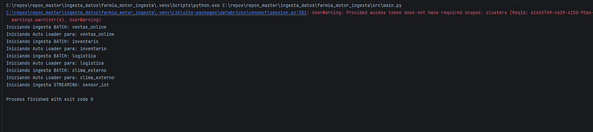
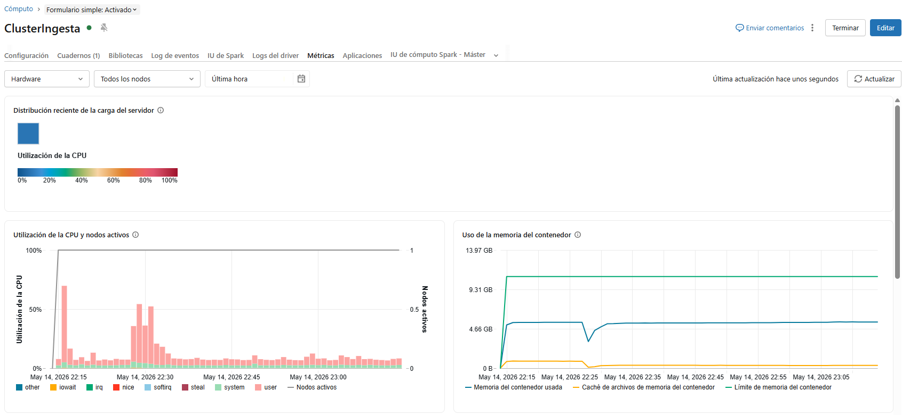
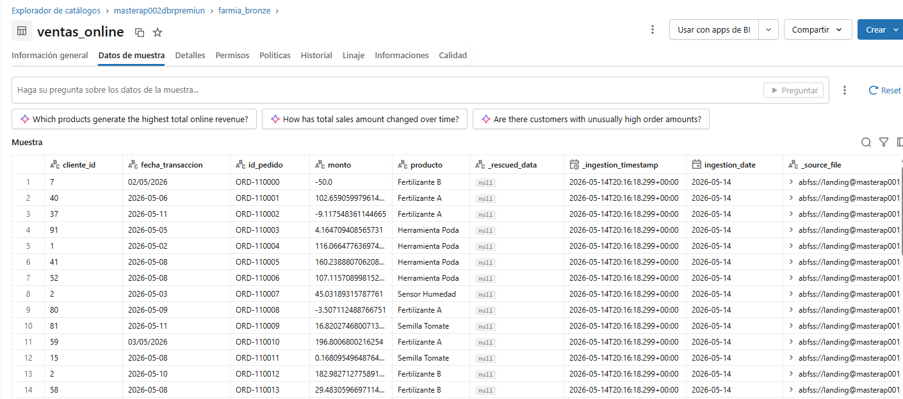
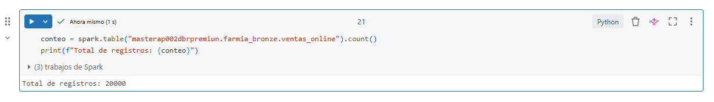
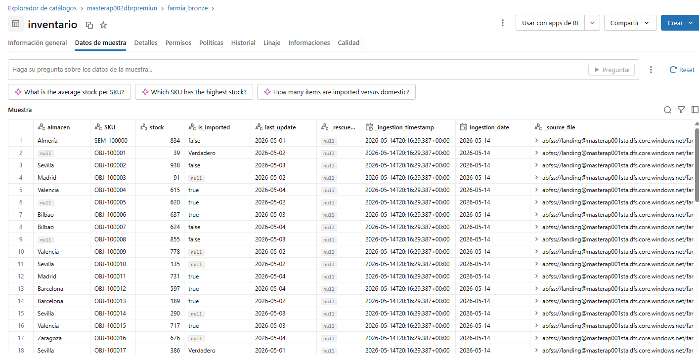
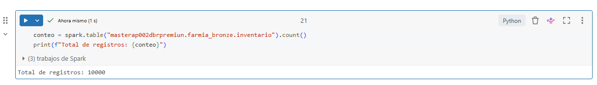
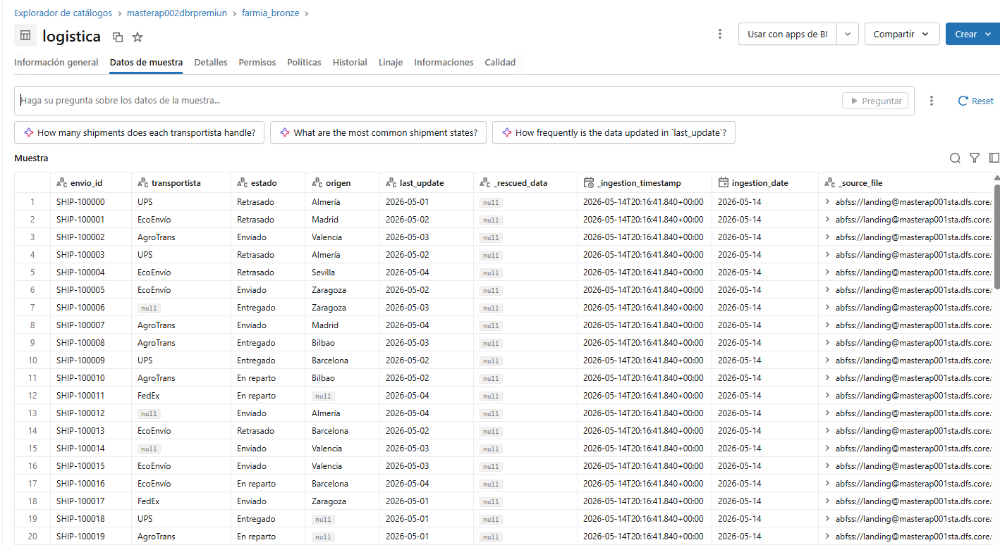
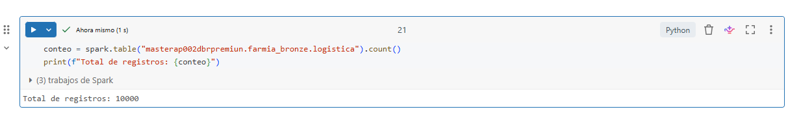
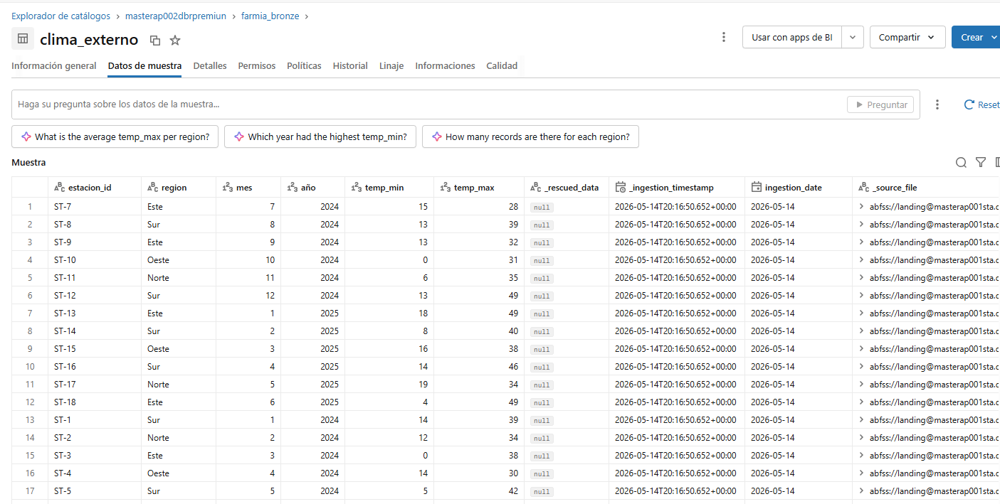
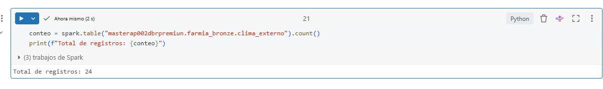

# Motor de Ingesta FarmIA - Data Lakehouse

Este proyecto implementa un motor de ingesta de datos avanzado basado en metadatos para FarmIA. La arquitectura sigue los principios de un Data Lakehouse en Azure, utilizando Databricks, Delta Lake y Confluent Cloud.

## 1. Arquitectura del Proyecto

El motor gestiona el ciclo de vida del dato desde la capa `Landing` hasta la capa `Bronze`, asegurando la inmutabilidad y trazabilidad de la información.

### Capas Landing:
- **Landing (Azure Data Lake Storage Gen2):** Zona de aterrizaje de archivos batch (JSON, CSV, Parquet, Avro).

### Capas del Lakehouse:
- **Bronze (Delta Lake):** Datos crudos con metadatos técnicos inyectados para auditoría.
- **Silver/Gold (Conceptual):** El diseño contempla transformaciones de limpieza (Silver) y agregaciones de negocio (Gold) para analítica avanzada, para este caso solo a modo de propuesta debido al proposito de la practica.

## 2. Estructura del Repositorio

```
farmia_ingestion_engine/
├── config/              # Configuraciones de infraestructura y negocio
│   ├── schemas/         # Esquemas Avro (.avsc) para datos de sensor Iot
│   ├── client.properties # Credenciales del cluster kafka
│   ├── client_schema.properties # Credenciales de schema_registry
│   └── datasets.json    # Definición de fuentes de datos
├── src/                 # Código fuente
│   ├── main.py          # Orquestador principal ejecuta las ingestas batch y streaming
│   ├── batch/           # Lógica de Databricks Auto Loader para ingesta batch
│   ├── streaming/       # Lógica de para ingesta streaming 
│   └── common/          # Utilidades de metadatos y carga de configs
└── README.md            # Guía de ejecución
```

## 3. Requisitos Previos

- **Python 3.10+**
- **Databricks Connect v2:** Configurado para conectar con un clúster en Azure Databricks.
- **Clúster Databricks:** Modo de acceso `Single User` (para permitir credenciales de Kafka en texto plano durante pruebas).
- **Confluent Cloud:** Clúster de Kafka y Schema Registry activos.

## 4. Configuración

### 4.1. Archivo datasets.json
Define qué datos se van a ingerir. Ejemplo de estructura:
```json
{
  "batch_datasets": [
    {
      "dataset_name": "ventas_online",
      "type": "batch",
      "format": "json",
      "source_path": "abfss://landing@account.dfs.core.windows.net/farmia/ventas_online/",
      "target_table": "farmia_bronze.ventas_online",
      "checkpoint_path": "abfss://lakehouse@account.dfs.core.windows.net/checkpoints/ventas_online/"
    }
  ],
  "streaming_dataset": [
    {
      "name": "sensor_iot",
      "kafka_topic": "sensor_iot",
      "target_table": "farmia_bronze.sensor_iot",
      "checkpoint_path": "abfss://lakehouse@account.dfs.core.windows.net/checkpoints/sensor_iot/",
      "partition_by": ["ingestion_date"]
    }
  ]
}
```

### 4.2. Metadatos Técnicos (Capa Bronze)
Cada registro ingerido incluye automáticamente:
- `ingestion_date`: Fecha de procesamiento (usada para particionamiento físico).
- `_ingestion_timestamp`: Timestamp exacto de entrada.
- `_source_file`: Ruta del archivo original (Batch) o identificador de stream (Streaming). Compatible con Unity Catalog mediante `_metadata.file_path`.

## 5. Ejecución

Para lanzar el motor desde PyCharm o terminal:

1. Asegurarse de que el entorno virtual esté activo.
2. Ejecutar el orquestador:
   ```bash
   python -m src.main
   ```

El motor cargará automáticamente todos los datasets definidos en la configuración y ejecutará las consultas de Spark tanto para archivos históricos como para eventos en tiempo real.

## 6. Monitoreo y Validación

- **Spark UI:** Acceder al clúster en Databricks para observar las métricas de Input/Process Rate en la pestaña de Structured Streaming.
- **Data Catalog:** Validar la creación de tablas en el esquema `farmia_bronze`.
- **Logs:** Revisar la consola de salida para confirmar el inicio de cada hilo de ingesta.

Como evidencia de la ejecucion realizada se adjunta los logs de la ejecucion:

Las metricas del cluster:



Y la carga de las tablas:

Ventas_online


Inventario



Logistica



Clima_externo



Sensor_iot


### Como Anotacion importante a tener en cuenta:

Dentro de la carpeta de entrega se veran los siguientes archivos:

- `folder farmia_motor_ingesta` - Esta carpeta contiene todo el motor de ingesta para el procesamiento batch y streaming, además incluye el diagrama del proceso de ingesta junto con su explicación.
- `Data_ingestor_farmia.py` - Este Notebook contiene toda la logica de generado de datos de las distintas fuentes que se generaron para la practica, este notebook se ejecutó directamente en Databricks.
- `Setup_farmia.py` - Este Notebook contiene la configuracion inicial del entorno de ingesta, inicialización de rutas de almacenaje y creación de esquemas. Esta notebook sirvió como base para la ejecucion del notebook Data_ingestor_farmia.py y tambien se ejecutó desde Databricks directamente.

---
**Autor:** Angelica Pineda
**Fecha:** Mayo 2026